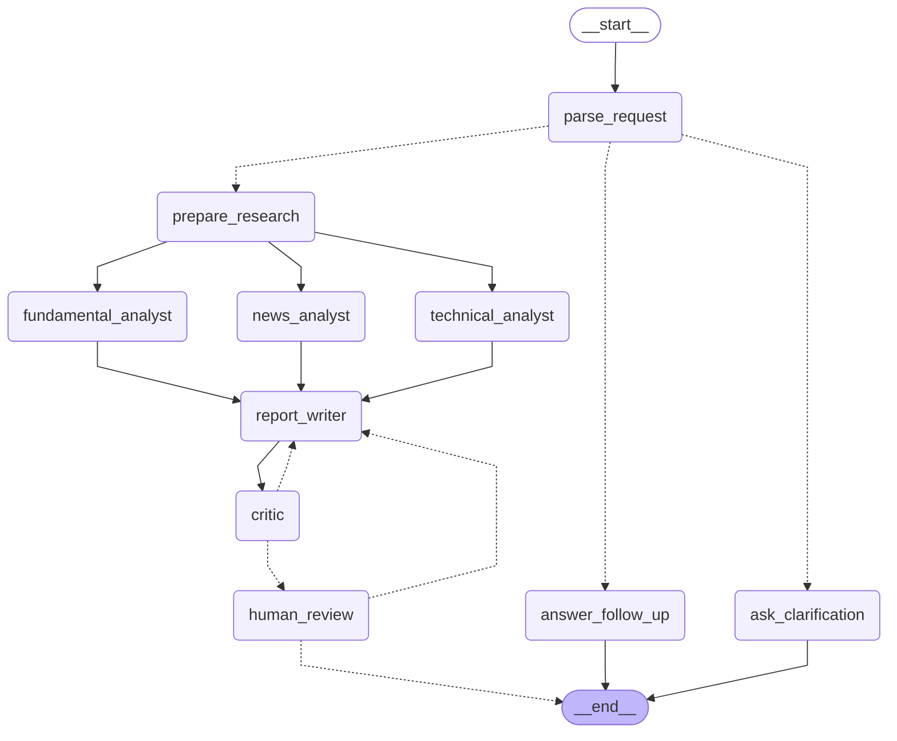
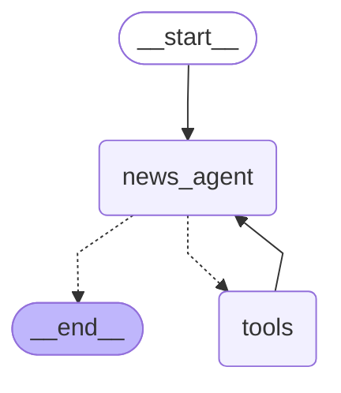

# Main graph

```mermaid
---
config:
  flowchart:
    curve: linear
---
graph TD;
	__start__([<p>__start__</p>]):::first
	parse_request(parse_request)
	ask_clarification(ask_clarification)
	answer_follow_up(answer_follow_up)
	prepare_research(prepare_research)
	fundamental_analyst(fundamental_analyst)
	technical_analyst(technical_analyst)
	news_analyst(news_analyst)
	report_writer(report_writer)
	critic(critic)
	human_review(human_review)
	__end__([<p>__end__</p>]):::last
	__start__ --> parse_request;
	critic -.-> human_review;
	critic -.-> report_writer;
	fundamental_analyst --> report_writer;
	human_review -.-> __end__;
	human_review -.-> report_writer;
	news_analyst --> report_writer;
	parse_request -.-> answer_follow_up;
	parse_request -.-> ask_clarification;
	parse_request -.-> prepare_research;
	prepare_research --> fundamental_analyst;
	prepare_research --> news_analyst;
	prepare_research --> technical_analyst;
	report_writer --> critic;
	technical_analyst --> report_writer;
	answer_follow_up --> __end__;
	ask_clarification --> __end__;
	classDef default fill:#f2f0ff,line-height:1.2
	classDef first fill-opacity:0
	classDef last fill:#bfb6fc
```

# News subgraph (tool-calling agent)

```mermaid
---
config:
  flowchart:
    curve: linear
---
graph TD;
	__start__([<p>__start__</p>]):::first
	news_agent(news_agent)
	tools(tools)
	__end__([<p>__end__</p>]):::last
	__start__ --> news_agent;
	news_agent -.-> __end__;
	news_agent -.-> tools;
	tools --> news_agent;
	classDef default fill:#f2f0ff,line-height:1.2
	classDef first fill-opacity:0
	classDef last fill:#bfb6fc
```
